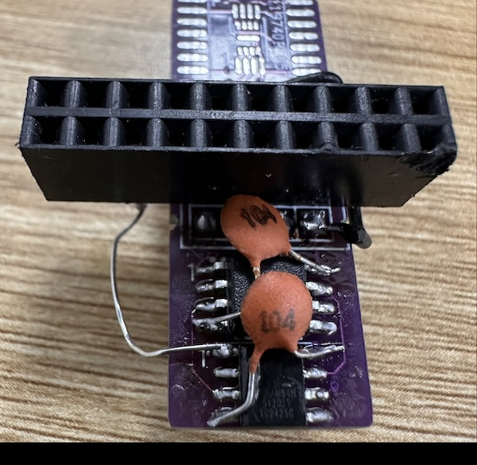

# SotaSoC

**SotaSoC** is a compact RISC-V System-on-Chip (SoC) targeting [**Tiny Tapeout**](https://tinytapeout.com) tape-out and also capable of running on **Artix 7 FPGA** with Vivado. Suitable for custom boards, teaching, and as a base for your own SoC. Software support includes **FreeRTOS**, **MicroPython** (in development), and **bare-metal**.

## 1. Overview

### Supported ISA Extensions

- **E** — RV32E: 32-bit RISC-V with 16 general-purpose registers (embedded profile).
- **C** — RISC-V Compressed instructions.
- **Zicsr** — Control and Status Register extension.
- **Zifencei** — Instruction-fetch fence extension.

### Peripherals

- **QSPI Flash** and **QSPI PSRAM** — 128 Mbit Flash for code and data, 64 Mbit PSRAM for runtime memory
- **UART** — programmable baud rate via 10-bit clock divider; default 115200 at 64 MHz
- **48-bit timer** (mtime)
- **13× GPIO** — 1 bidirectional (in/out), 6 input (with interrupt), 6 output
- **2× PWM** — 2 independent channels; 16-bit period and duty (in clock cycles), configurable frequency and duty cycle per channel
- **SPI** — master; full mode support (CPOL/CPHA), clock up to 16 MHz, configurable; 4-byte buffer
- **I2C** — master; clock configurable via 8-bit prescaler — 100 kHz, 400 kHz, 1 MHz, and others; START, STOP, repeated START, byte read/write with ACK/NACK

### Board Support Package (BSP)

A BSP is available for **FreeRTOS** and **bare-metal** development:

- [FreeRTOS BSP](https://github.com/sotatek-dev/SotaSoC-BSP/tree/main/FreeRTOS)
- [Bare-metal BSP](https://github.com/sotatek-dev/SotaSoC-BSP/tree/main/examples)

### Demo

SotaSoC is capable of driving real-world applications such as a **320×240 ST7789 LCD** display via SPI.


*The photo above was taken from a test on an Artix 7 FPGA; the tapeout chip is not yet available.*

More examples and demos are available in the [SotaSoC-BSP](https://github.com/sotatek-dev/SotaSoC-BSP) repository.

*Tape-out layout:* Current area is 197,876 µm²; there is still room to add more features.


---

## 2. Technical Overview

### Architecture

The SoC is built around a single **RV32E core** connected to a **memory controller** that handles instruction fetch and data access. The controller routes instruction fetches to **QSPI Flash**, data reads/writes to **QSPI PSRAM** or peripherals, and forwards peripheral accesses to the appropriate blocks (UART, GPIO, timer, PWM, I2C, SPI). All peripherals are memory-mapped.

- **Instruction path:** Core → mem_ctl → QSPI Flash (execute-in-place or preloaded).
- **Data path:** Core → mem_ctl → QSPI PSRAM or peripheral registers.

### CPU Core

- **RV32E** with 16 general-purpose registers; **RESET_ADDR** = `0x0000_0000` (configurable).
- **Pipeline:** ALU, CSR (Zicsr), branch/jump handling.
- **C extension** supported via decompression in the fetch path (`rv32c_decompress`).
- **Timer:** 48-bit **mtime** from the SoC; core supports **mtimecmp** and timer interrupt (MTIP) for RISC-V timer semantics.
- **Interrupts:** Timer interrupt (MTIP) and external interrupt (MEIP). Full machine-mode support: **MSTATUS** (MIE, MPP), **MIE**, **MIP**, **MTVEC**, **MCAUSE**, and **MEPC** for trap handling and return.
- **Compliance:** The core has passed all tests for extensions **E**, **C**, and **Zicsr** in the [RISC-V Compatibility Framework](https://github.com/riscv-non-isa/riscv-arch-test) (RISCOF).

### Memory

- **QSPI Flash:** 128 Mbit; program (and optionally data) storage; base address `0x0000_0000`.
- **QSPI PSRAM:** 64 Mbit; runtime RAM; base address `0x0100_0000`.

### Memory Map

| Base address   | Region        | Description                    |
|----------------|---------------|--------------------------------|
| `0x0000_0000`  | Flash         | QSPI Flash (code/data)         |
| `0x0100_0000`  | PSRAM         | QSPI PSRAM (runtime memory)    |
| `0x4000_0000`  | UART          | UART control and data          |
| `0x4000_1000`  | GPIO          | GPIO (bidir, in, out)          |
| `0x4000_2000`  | Timer         | 48-bit mtime / mtimecmp        |
| `0x4000_3000`  | PWM           | 2× PWM channels                |
| `0x4000_4000`  | I2C           | I2C master                     |
| `0x4000_5000`  | SPI           | SPI master                     |

Peripheral decode uses the high bits of the address; each peripheral has a 256-byte (`0x100`) space.

### Hardware and Tools

- **Targets:** Tiny Tapeout; Artix 7 FPGA with Vivado.
- **Clock / reset:** Single clock and active-low reset; exact frequency is board-dependent.

### Clock and Performance (CPI)

- **Clock:** Target system clock **64 MHz**.
- **Performance:** SoC performance is dominated by **instruction fetch** over QSPI. Fetching one 32-bit instruction takes 8 QSPI cycles, or 16 system cycles → the core runs at an effective **4 MHz** (32-bit instructions). With **compressed (C)** instructions, effective rate is **8 MHz**.
- **Note:** Each instruction completes before the next is fetched (no overlap), so the core has **no hazard handling**.
- **CPI (cycles per instruction):** Approximate CPI by instruction type:

| Instruction type   | CPI (notes)                    |
|--------------------|--------------------------------|
| ALU (R/I)          | 1                              |
| Load / Store peripherals | 1 (memory-mapped I/O)  |
| Load from Flash            | ~5                     |
| Load from RAM              | ~5.25                  |
| Store to RAM               | ~4                     |
| Branch (taken)     | ~2.5                              |
| Branch (not taken) | 1                              |
| Jump               | ~2.5                              |
| CSR                | 1                              |

*Note: The CPI values are expressed as if the core ran at 4 MHz (effective instruction rate for 32-bit fetch). This makes it easier to compare with other CPUs at the same equivalent clock.*

---

## 3. Getting Started

### Clone the repository

```bash
git clone git@github.com:sotatek-dev/SotaSoC.git
cd SotaSoC
git submodule update --init --recursive
```

The repo uses submodules (e.g. `tb/riscof/riscv-arch-test` for RISCOF); use `--recursive` on first clone or run `git submodule update --init --recursive` after cloning.

### Dependencies

- **Tested on:** Ubuntu 24.04 (other Linux distros may work with equivalent packages).
- **Required:** `make`, `python3`, `python3-pip`, `libpython3-dev`, `iverilog` (for simulation).
- **Cocotb:** Used for testbenches. Install via a virtual environment and pip — see **§4. Testing → Environment Setup** below for the exact commands.
- **Optional:** RISC-V toolchain (`riscv64-unknown-elf-gcc`, `riscv64-unknown-elf-objcopy`, etc.) to compile tests and firmware; available in [riscv-collab/riscv-gnu-toolchain](https://github.com/riscv-collab/riscv-gnu-toolchain) or your distro.

---

## 4. Testing

### Environment Setup

Install required dependencies:

```bash
sudo apt-get install make python3 python3-pip libpython3-dev iverilog
python -m venv venv
source venv/bin/activate
pip install "cocotb~=2.0"
```

### Core Tests

Run the core test suites:

```bash
make -f tb/cocotb/test_rv32i_core.mk
make -f tb/cocotb/test_rv32i_core_jump.mk
```

### RISC-V Tests

Run the complete RISC-V test suite:

```bash
./scripts/test_all_bin_spi.sh
```

To test individual files:

```bash
make -f tb/cocotb/test_spi_mem.mk TESTCASE=test_spi_bin_file BIN_FILE=tb/riscv-tests/bin/addi.S.bin
```

### RISCOF Tests

For RISCOF (RISC-V Compatibility Framework) testing, see [tb/riscof/README.md](tb/riscof/README.md).

### Testing Your Own Program

To test your own RISC-V program:

1. Compile your program to ELF format
2. Convert to binary format:
   ```bash
   riscv64-unknown-elf-objcopy -O binary program.elf program.bin
   ```
3. Run the test with your binary:
   ```bash
   make -f tb/cocotb/test_spi_mem.mk TESTCASE=test_spi_bin_file BIN_FILE=program.bin
   ```

---

## 5. Building and running on FPGA

### Required hardware

- **FPGA:** Tested with **Artix 7**. Other Xilinx 7-series boards may work with constraint changes.
- **QSPI Pmod:** The SoC expects external QSPI Flash and PSRAM. You need a **QSPI Pmod** (or equivalent) connected to the FPGA:
  - **Buy assembled:** [QSPI Pmod at Tiny Tapeout Store](https://store.tinytapeout.com/products/QSPI-Pmod-p716541602) (128 Mbit Flash + 2× 64 Mbit PSRAM; compatible with TT04 and later).
  - **Make your own:** Use the open design and KiCad files in [mole99/qspi-pmod](https://github.com/mole99/qspi-pmod).
  - **Hand-solder:** Or build a board yourself and hand-solder the Flash/PSRAM chips. Use **Flash** W25Q128JVSIQ (or equivalent) and **PSRAM** ESP-PSRAM64H (or equivalent). Example:

  

### Build the bitstream (FPGA)

1. Open the Vivado project:
   ```bash
   vivado vivado/Rv32I.xpr
   ```
2. In Vivado: run **Generate Bitstream** (or: Synthesis → Implementation → Generate Bitstream).
3. Constraints are in `vivado/Rv32I.srcs/constrs_1/new/rv32e.xdc`. Adjust clock and pins for your Artix 7 board if needed.

### Load your program into QSPI Flash

1. **Build your program** (same as in §4. Testing):
   - Compile to ELF (e.g. with `riscv64-unknown-elf-gcc`).
   - Convert to raw binary:
     ```bash
     riscv64-unknown-elf-objcopy -O binary program.elf program.bin
     ```
   - Or use a **pre-built binary** from the [SotaSoC-BSP](https://github.com/sotatek-dev/SotaSoC-BSP) (examples and demos are often provided as `.bin` files).

2. **Load the binary into QSPI Flash:** Load the `.bin` file into the **QSPI Flash** on the QSPI Pmod (or equivalent) described in **Required hardware** above. Write `program.bin` to the start of Flash at address `0x0000_0000`.

### Connecting the QSPI Pmod to the FPGA

Wire the QSPI Pmod to the FPGA as defined in `vivado/Rv32I.srcs/constrs_1/new/rv32e.xdc`. The design uses the **uio** pins (bidirectional) for the shared QSPI bus:

| Pmod pin | Signal      | FPGA port | Package pin (rv32e.xdc) |
|----------|-------------|-----------|--------------------------|
| 1        | CS0 (Flash) | uio[0]    | F13                      |
| 2        | SD0 / MOSI  | uio[1]    | B13                      |
| 3        | SD1 / MISO  | uio[2]    | F14                      |
| 4        | SCK         | uio[3]    | C13                      |
| 5        | SD2         | uio[4]    | D14                      |
| 6        | SD3         | uio[5]    | D16                      |
| 7        | CS1 (RAM A) | uio[6]    | A14                      |
| 8        | (cut trace) | uio[7]    | J19                      |

Connect Pmod pin 1–8 to the FPGA pins listed above (or to the same *logical* pins on your board if the XDC is for a different package). If you use another board, edit `rv32e.xdc` to match your schematic.

### Program the FPGA

- Use **Vivado Hardware Manager**: connect the board, open the generated `.bit` file, program the device.
- Or use your board's usual method (e.g. Digilent Adept, openocd, or a built-in programmer).

After programming the FPGA and applying reset, the core runs from **RESET_ADDRESS** (default `0x0000_0000`). Ensure your firmware is loaded at that address in QSPI Flash (see **Load your program into QSPI Flash** above).

---

## 6. Project Structure

```
├── rtl/                     # RTL source files
│   ├── soc.sv               # SoC top level
│   ├── mem_ctl.sv           # Memory controller (QSPI Flash/PSRAM, peripheral decode)
│   ├── rv32i_core.sv        # RV32E core
│   ├── rv32i_csr.v          # CSRs (MSTATUS, MIE, MTVEC, MCAUSE, etc.)
│   ├── rv32i_alu.v          # ALU
│   ├── rv32i_register.v     # Register file
│   ├── rv32c_decompress.v   # C extension decompression
│   ├── debug_defines.vh     # Debug macros
│   └── peri/                # Peripherals
│       ├── uart/            # UART (uart_ctl, uart_tx, uart_rx)
│       ├── timer/           # 48-bit mtime (mtime_timer.v)
│       ├── gpio/            # GPIO
│       ├── pwm/             # PWM (2 channels)
│       ├── i2c/             # I2C master
│       ├── spi/             # SPI master
│       └── mem/             # QSPI memory (qspi_mem.v, spi_mem.v)
├── tb/                      # Testbenches and test assets
│   ├── cocotb/              # Cocotb testbenches (core, CSR, GPIO, PWM, I2C, SPI, UART, timer, spi_mem)
│   ├── riscof/              # RISC-V Compatibility Framework (RISCOF)
│   ├── riscv-tests/         # RISC-V test suite (rv32ui, etc.)
│   └── *-tests/             # UART, SPI, I2C test dumps/hex
├── scripts/                 # Utility scripts
│   ├── test_all_bin_spi.sh  # Run full RISC-V binary test suite
│   ├── test_cocotb.sh       # Run Cocotb tests
│   ├── test_uart.sh         # UART tests
│   ├── test_spi.sh          # SPI tests
│   └── test_i2c.sh          # I2C tests
├── vivado/                  # Vivado project (Artix 7 FPGA)
│   ├── Rv32I.xpr            # Project file
│   ├── Rv32I.srcs/
│   │   ├── sources_1/new/   # top.v
│   │   ├── sources_1/ip/    # Clock wizard IP
│   │   └── constrs_1/new/   # rv32e.xdc
│   └── *.tcl                # Floorplan, reporting
├── Makefile
└── README.md
```

---

## License

This project is licensed under the **MIT License**. See the [LICENSE](LICENSE) file in the repository root for the full text.

---

## References

- **[RISC-V Specification](https://riscv.atlassian.net/wiki/spaces/HOME/pages/16154769/RISC-V+Technical+Specifications)** — ISA and privileged spec.
- **[RISC-V Compatibility Framework (RISCOF)](https://github.com/riscv-non-isa/riscv-arch-test)** — Architectural tests used for compliance.
- **[riscv-tests](https://github.com/riscv-software-src/riscv-tests)** — Unit tests for RISC-V processors (ISA tests, benchmarks); used in `tb/riscv-tests` for simulation.
- **[Cocotb](https://github.com/cocotb/cocotb)** — Python-based cosimulation for RTL testbenches.
- **[Tiny Tapeout](https://tinytapeout.com)** — Open-source shuttle for small tape-outs; SotaSoC targets this flow.
- **[QSPI Pmod](https://github.com/mole99/qspi-pmod)** — Open QSPI Flash/PSRAM Pmod design (KiCad); [store](https://store.tinytapeout.com/products/QSPI-Pmod-p716541602).
- **[UART (ben-marshall/uart)](https://github.com/ben-marshall/uart)** — Verilog UART (TX/RX) used in the SoC peripheral; MIT License, Ben Marshall.

## Related work

### RISC-V Cores/SoC
- **[PicoRV32](https://github.com/YosysHQ/picorv32)**
- **[VexRiscv](https://github.com/SpinalHDL/VexRiscv)**
- **[NEORV32](https://github.com/stnolting/neorv32)**

### SoCs / projects (Tiny Tapeout, QSPI Pmod)
- **[KianV](https://github.com/splinedrive/kianRiscV)**
- **[TinyQV](https://github.com/MichaelBell/tinyQV)**


